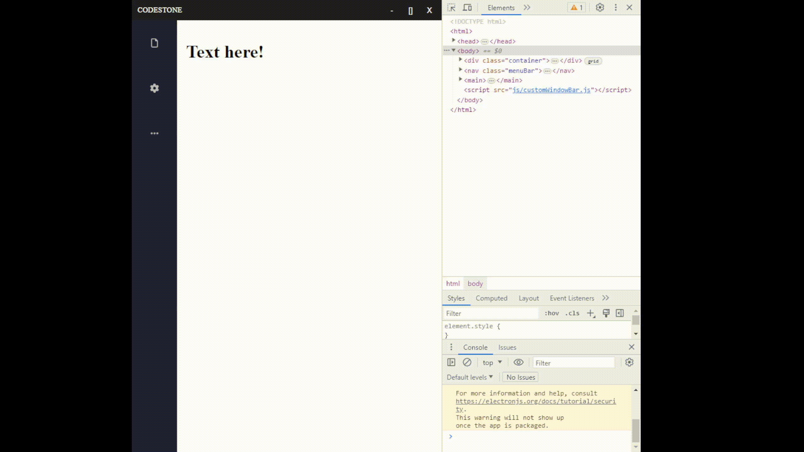

# Codestone Updates (Kevin's Branch)

Responsible for the code section of the Codestone Application

Progress so far:

## Version 0.0.2k
- 10/06/2023
    - menu bar will remain stationary when an option is clicked
      (menu bar will collapse if it is clicked outside of the bar)

- 10/05/2023
    - added 'about' (the option in menu bar) functionality to create child window
    - can minimize, maximize, close the 'about' window
    - moved some existing files into their respective folders

- 10/04/2023 (Branched from main)
    - added text editor
    - added fonts, color, highlight, bold, underline, italics
    - added transparency to the rest of the window when access menu bar
    - improved icons on window bar

- 10/02/2023
    - improved menu bar interface

## Version 0.0.1k
- 09/25/2023
    - added menu bar

- 09/24/2023
    - added some functions to the window bar (minimize, maximize, close)
    - draggable window
    - modified package-lock.json

- 09/22/2023
    - added folders for organization (css, html, img, js)
    - customized window bar of the window application

- 09/21/2023
    - Setup python environment
    - Setup node.js & electron.js

## References:
- https://www.youtube.com/playlist?list=PLTHrJfrjCyJAxErpBW4B1IXFU3tpn61r6
    - followed during beginning stages of developement
- https://www.youtube.com/playlist?list=PL_2VhOvlMk4VDwjplg7Bg3qq-R3_z5OJW
    - learned how to use electronJS, IPC, etc
- https://youtu.be/biOMz4puGt8?si=Xpiplz6IZYSfeiTD
    - followed to create a menu bar